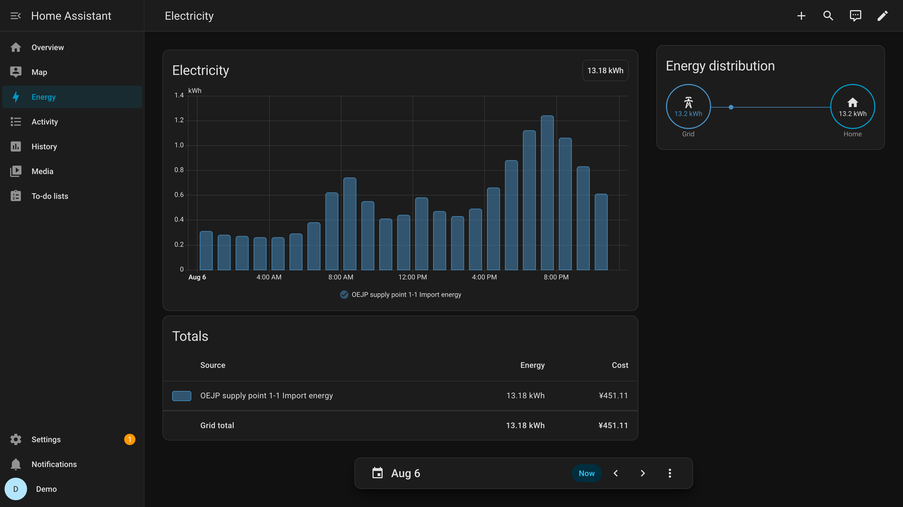
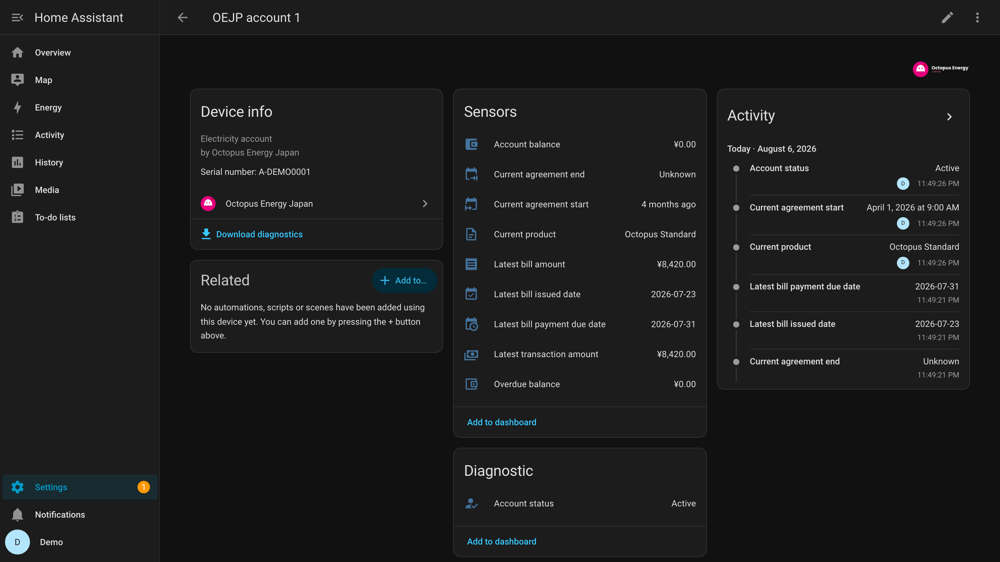

<picture>
  <source media="(prefers-color-scheme: dark)" srcset="custom_components/octopus_energy_japan/brand/dark_logo.png">
  
</picture>

# Octopus Energy Japan for Home Assistant

A read-only Home Assistant custom integration for Octopus Energy Japan. It brings
your half-hourly electricity readings, calendar totals, and Energy Dashboard statistics —
including cost — into Home Assistant. When a reading is corrected later, the statistics are
corrected with it.

日本語の案内は [`docs/ja/README.md`](docs/ja/README.md) にあります。

> [!WARNING]
> Unofficial. Not affiliated with, endorsed by, or supported by Octopus Energy Japan
> or Kraken Technologies.

## What it does

- Half-hourly import and export readings for every electricity supply point on every
  account your login can see.
- Today, yesterday, week, and month totals on Asia/Tokyo calendar boundaries.
- Energy Dashboard statistics rebuilt from a stored copy of every reading, so a reading
  corrected later also corrects every total that used it.
- An hourly cost statistic computed from your own tariff — price steps, standing
  charge, fuel-cost adjustment, and renewable levy. You enter no prices.
- Optional account, contract, and billing summaries, with financial entities off by
  default.
- Diagnostics you can attach to a public issue without reading them first.

It is read-only: it never changes your Octopus Energy Japan account, submits no meter
readings, and makes no payments. Nothing is sent to any server the developer runs.

## What it looks like

> [!NOTE]
> Every figure in these three images is invented. They come from a throwaway Home Assistant
> holding synthetic statistics, not from anyone's account: no real consumption, cost, account
> number, supply-point number, or address appears in this repository.

Half-hourly readings become hourly Energy Dashboard statistics, and the cost beside them is
computed from your own tariff rather than a price you type in.

Each account is a device too, carrying the contract and billing summaries. The financial
entities are off by default and are enabled here to show them.

## What it supports

There is no hardware to pair. The integration reads the Octopus Energy Japan API, so it
supports whatever your account exposes.

| Supported | Detail |
|---|---|
| Electricity supply points | every point on every account your login can see |
| Multiple accounts | one Home Assistant entry covers all accounts for one login |
| Import and export | export appears only when reported for your supply point |
| Meters, devices, registers | discovered when exposed; not required |
| Ended accounts and supply points | discovered, disabled by default, selectable |
| Gas | not supported. Electricity only |

## Typical uses

- Watch yesterday's and this month's electricity use without opening the Octopus Energy Japan app.
- Put consumption and cost on the Energy Dashboard beside solar, battery, or a
  locally measured circuit.
- Automate on consumption, such as a notification when today's use passes a threshold.
- Keep long-term history. The integration stores every interval it collects, so your
  history keeps growing.

It is not a billing tool. See [known limitations](#known-limitations).

## Installation

1. Add this repository to HACS and install **Octopus Energy Japan**.
2. Restart Home Assistant.
3. **Settings → Devices & services → Add integration → Octopus Energy Japan**.
4. Sign in with your Octopus Energy Japan email address and password.

### About the sign-in method

Email and password is the only method offered, and the only one that can work.

Asked directly, Octopus Energy Japan replied on 2026-08-06 that OAuth is not supported in
Japan and that it offers no API service to individual customers. Two OAuth methods —
**Account (browser)** and **Device code** — are implemented and measured against the
provider's own authorization server, but both need a client the provider will not issue,
so neither is listed. They appear by themselves if that ever changes, or if you hold a
client of your own and add it under **Settings → Devices & services → Application
credentials**.

| | Email and password | Device code | Account (browser) |
|---|---|---|---|
| Offered today | **yes** | no — no client exists | no — no client exists |
| Where you sign in | in Home Assistant | on the Octopus Energy Japan website, from any device | on the Octopus Energy Japan website |
| Your password | **stored in Home Assistant** | never requested | never requested |
| Needs My Home Assistant | no | no | yes |

**Email and password** works today. Both are stored in Home Assistant — not for
convenience, but because the refresh token lasts seven days and renewing it does not
extend those seven days, so after that nothing but the credential itself can sign in. What is
stored and where is in [`PRIVACY.md`](PRIVACY.md). This is Octopus Energy Japan's older login
and can stop being accepted without notice; Home Assistant then asks you to reconnect.

**Device code** and **Account** are kept but not offered, for the reason above. The client
id is an empty constant in the code; filling it in is the only change either would need.
Device code needs no browser redirect, which would make it the better of the two for an
instance with no public address.

### Switching later, without losing history

Open the integration's menu, choose to reconnect, and pick another method. The entry is
switched in place: your readings and Energy Dashboard statistics are kept, and any stored
password is deleted. Do not delete and re-add.

### My Home Assistant

Required for the account method only. It is part of `default_config:`, so a normal
installation already has it. Sign-in returns through `my.home-assistant.io`, the one
registered redirect address, which forwards the result to your instance. On a
stripped-down configuration, add `my:` to `configuration.yaml` and restart.

### Configuration parameters

You never enter an API key, an account number, or a supply point number. Everything else is
discovered from the account you sign in with.

| Parameter | Where | Required for | Meaning |
|---|---|---|---|
| Email and password | setup → **Email and password** | that method | your Octopus Energy Japan sign-in, stored so the integration can sign in again |
| OAuth client ID | nothing to enter | the two OAuth methods | ships in the code, one client for every installation. Add your own under **Application credentials** only if you hold one |
| Enabled historical resources | integration → **Configure** | nothing | which ended accounts or supply points keep reporting |

Active accounts and supply points are always enabled, so a new supply point starts
reporting on its own.

## Entities

Every entity belongs to a device: one per account, and one per supply point beneath
it. Names are ordinal — `OEJP supply point 1-1` — and carry no account number, supply
point number, or address, so a screenshot or a pasted automation carries none either.

To tell which supply point a device is, open its device page: the supply point number
(供給地点特定番号) is shown as the serial number, and the account device shows your
account number. Those stay off entity IDs, states, attributes, and diagnostics.

### Per supply point

Enabled by default:

| Entity | What it is |
|---|---|
| Latest reported interval consumption | the newest 30-minute value published |
| Consumption today / yesterday | calendar totals in Asia/Tokyo |
| Consumption this week / this month / last month | calendar totals in Asia/Tokyo |
| Latest reading timestamp | when the newest interval ended |
| Data delay | how far behind the newest interval is |
| Status | whether the supply point is active or ended |
| Data available | whether readings are currently arriving |
| Meter reading day | the day of the month your account reports for the meter read. It can differ from the day the price steps restart on, which is taken from your scheduled reading dates; your diagnostics download says which |

Disabled by default: **Address** — the address held for this supply point's property,
so that with more than one property you can tell which device is which. It is off
until you enable it because an entity state is written to the recorder database and
included in backups. See [`PRIVACY.md`](PRIVACY.md).

A calendar total reports **unknown** until every interval in the period has arrived. A
half-synchronised day would otherwise look like a complete day that used very little
electricity.

There is no *current power* entity: the API publishes 30-minute totals, not live
power, and presenting an average as instantaneous would be wrong. There is no *next
meter reading* entity either — the two dates the API exposes for it are not kept up to
date.

### Per account

Enabled by default: account status, current product, current agreement start and end.

Disabled by default, because they are financial: account balance, overdue balance,
latest bill amount, latest bill issued date, latest bill payment due date, latest
transaction amount.

## How data updates

| What | How often |
|---|---|
| Readings | every 30 minutes, re-reading the last 72 hours |
| Account and supply-point discovery | every 24 hours |
| Contract and billing | every 12 hours |
| Full reconciliation | daily, over the current and previous month |

**Readings arrive late.** An interval is published several hours after it happens,
sometimes longer. Nothing is missing; it has not been published yet.

**Readings get corrected.** When a billing period closes, intervals are reissued with
a new version and values can change. The integration stores every interval rather than
a running total, so a correction also updates every later Energy Dashboard total.

**Startup does not stall.** Setup completes from recent data; older history is fetched
in the background afterwards.

## Energy Dashboard

**Settings → Dashboards → Energy → Grid consumption → Add consumption**, then pick the
statistic named after your supply point, for example `OEJP supply point 1-1 Import
energy`. If an export direction is reported, add `… Export energy` under **Return to
grid**.

Pick the **statistic**, not one of the consumption sensors listed above. Those sensors are
for display. Only a statistic can be rewritten when a reading is corrected.

Set cost to `OEJP supply point 1-1 Import cost`. Leave the price fields empty — Home
Assistant only multiplies a *sensor* by a price and skips that for an external
statistic, so anything entered there is ignored. The cost statistic replaces it.

There is no export cost statistic. Energy you send back is paid for under a separate
arrangement, so pricing it at a consumption rate would show money you are not being
charged. Leave **Return to grid** without a cost.

Treat cost as a close estimate, not your bill. On the one account this has been checked
against, one closed bill came to 104% of the billed total — a single measurement on one plan in
one service area, not a figure to expect on yours.
[Known limitations](#known-limitations) explains what still makes a total differ.

## Known limitations

**Cost is an estimate.** Every price is read from your own agreement, so nothing is guessed
and nothing is assumed about your area or your plan. Three things still make the total differ
from your bill:

- The price steps restart on the day of the month your meter is read, taken from what your
  account reports. The provider publishes no time of day for the read, so each boundary can be
  a few hours out.
- Only the current month's fuel-cost adjustment is available from Octopus Energy Japan. The
  integration keeps every one it sees, so accuracy improves the longer it runs; until an hour's
  own adjustment has been collected it is priced with the nearest one that has.
- Whether the standing charge your account reports is already worked out for your contracted
  amperage is not confirmed. Your diagnostics download says what the provider calls it.

**Some plans cannot be priced at all.** A plan whose price varies by time of day, or that
includes a charge measured in something other than consumed kilowatt-hours, cannot be expressed
by this calculation. When that happens no cost statistic is published and a repair message says
so — your consumption, calendar totals, and the Energy Dashboard energy statistics are
unaffected. Pricing part of such a plan would look like it worked while being wrong.

**The cost figure Octopus Energy Japan returns per interval is not shown.** It combines the
fuel-cost adjustment and the renewable levy into one number and cannot express the daily
standing charge, so it does not add up to a billed total either.

**A first install starts with the current and previous month.** Everything older is collected
only when you press **Import full history** on a supply point's device page. It takes hours, it
paces itself to about a third of the request allowance your account is given, and it stops on
its own once it reaches the point where your readings begin.

What it collects reaches the Energy Dashboard statistics. It does **not** change the today,
this week, this month, or last month sensors, which only ever aggregate the current and previous
month. If your readings arrive through Octopus Energy Japan's legacy path — which returns only
the most recent 31 days however far back it is asked — the collection stops rather than record a
month as a complete history, and a repair message says so.

**Calendar totals are not billing periods.** Every total here uses Asia/Tokyo calendar days,
weeks, and months, whatever timezone your Home Assistant is set to. Japan has one timezone and
no daylight saving, and your consumption is measured and billed in it, so a total on your own
timezone's day boundary would match nothing the provider reports. Your bill uses the period
between two meter reads, so calendar totals will not match it either, by design. The cost
statistic does follow the meter-reading period.

**Contract information may be unavailable.** Some accounts are not authorised for
agreement data. Consumption is unaffected; those entities stay unavailable and a
repair message explains it.

## Troubleshooting

Start with **Settings → System → Repairs**. The integration raises a plain-language
message for each condition it can detect, and each says whether you need to act.
Usually you do not.

| Symptom | Likely cause |
|---|---|
| Setup says My Home Assistant is required | `my` is not loaded. Add `my:` or restore `default_config:` and restart. Account method only |
| Asked to reconnect a password entry | your password changed, or password login stopped being accepted |
| Totals say **unknown** | the period is not fully covered yet. Normal soon after install |
| Latest interval is hours old | normal publishing delay. Check *Data delay* |
| Entities went unavailable together | a refresh failed. The integration retries automatically |
| Financial entities missing | they are disabled by default. Enable them individually |
| Energy Dashboard totals changed retroactively | an interval was corrected. Expected |

### Reporting a problem

Download diagnostics from the integration's menu and attach the file to a
[GitHub issue](https://github.com/SteveShin323/ha-octopus-energy-japan/issues). It
contains no token, email address, account number, supply point number, address,
reading value, or monetary amount, so you do not need to review it first. Please do
not paste Home Assistant logs, which can contain text from Octopus Energy Japan.

## Removing the integration

**Settings → Devices & services → Octopus Energy Japan → Delete.** This deletes the
entry's stored readings, synchronisation checkpoints, Energy Dashboard statistics,
installation secret, and any stored credential. An OAuth entry also revokes its
authorization; a password entry cannot, because Octopus Energy Japan does not let a customer
invalidate a refresh token. That token expires within seven days instead. To cut access off
at once, change your password.

One thing survives on purpose: any **application credential** you added by hand stays, so
re-adding does not mean entering it again. Remove it under **Settings → Devices & services →
Application credentials**. The client that ships with the integration leaves nothing behind.

Re-adding starts a fresh local history and downloads the current and previous month
again. Statistics are deleted rather than kept because they cannot be continued: the
installation secret goes with the entry and statistic identifiers are derived from it, so a
re-added entry writes to new ones. Keeping the old rows left two identically named series in
the Energy dashboard picker. If you removed an entry from an earlier build, delete those
leftovers under **Developer tools → Statistics**.

## Privacy

Your data stays in your Home Assistant. There is no telemetry and no
developer-operated server. See [`PRIVACY.md`](PRIVACY.md).

## Project status

Stable, from 1.0.0. Everything listed under [what it does](#what-it-does) is implemented,
covered by tests, and verified against a real account. Entity IDs, unique IDs, statistic IDs,
and stored formats are settled: a change that would break an automation or an Energy
dashboard now needs a major version.

| Item | State |
|---|---|
| The two OAuth sign-in methods | implemented and kept, not offered — the provider will issue no client. [ADR 0001](docs/adr/0001-oauth-public-client.md) |
| Account shapes other than one account with one supply point | handled in code, not verified against a real account of that shape. [API contracts](docs/API_CONTRACTS.md) |

## Documentation

- [Privacy](PRIVACY.md) — what is stored, what leaves your instance, what survives removal
- [Architecture](docs/ARCHITECTURE.md) — how the integration is built
- [API contracts](docs/API_CONTRACTS.md) — API behaviour a contributor must not break
- [Development](docs/DEVELOPMENT.md) — tests, live probes, releases
- [Decision records](docs/adr/) — why the design is what it is
- [Changelog](CHANGELOG.md)

## Contributing

Read [`CONTRIBUTING.md`](CONTRIBUTING.md), [`SECURITY.md`](SECURITY.md), and
[`CODE_OF_CONDUCT.md`](CODE_OF_CONDUCT.md) first.

One rule matters more than the rest: **do not assert API behaviour that was not
observed.** A behaviour read from documentation is unverified until a probe confirms
it. Several defects in this project's history came from skipping that.

## License

MIT
