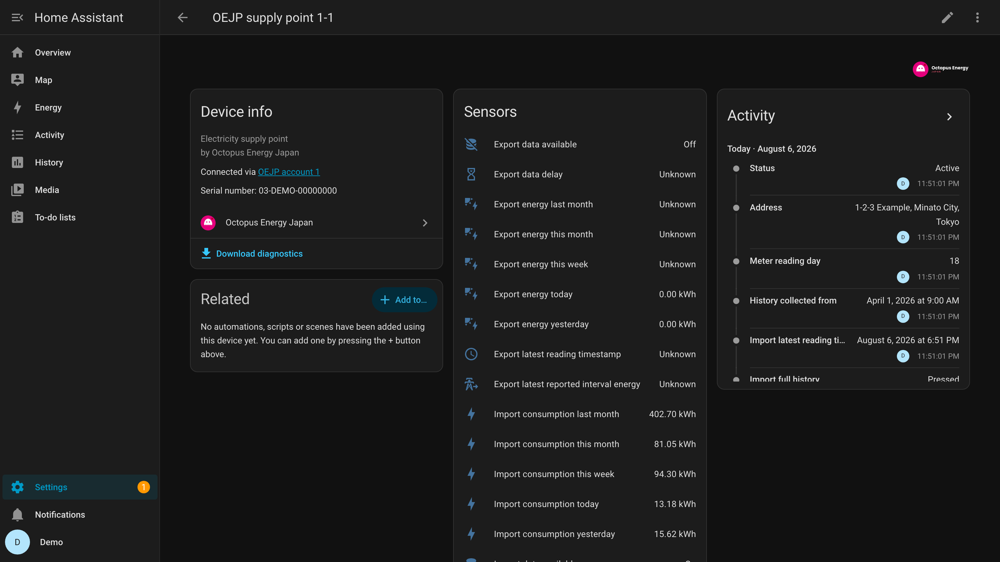

<picture>
  <source media="(prefers-color-scheme: dark)" srcset="../../custom_components/octopus_energy_japan/brand/dark_logo.png">
  
</picture>

# Octopus Energy Japan 連携（Home Assistant）

Octopus Energy Japan の電気使用量を Home Assistant に取り込む、読み取り専用のカスタム
統合です。30 分ごとの使用量、カレンダー集計、訂正に追従する Energy Dashboard 統計
（料金を含む）を提供します。

正式な文書は英語版 [`README.md`](../../README.md) です。

> [!WARNING]
> 非公式の統合です。Octopus Energy Japan および Kraken Technologies とは提携しておらず、
> 両社による承認や支援も受けていません。

## できること

- 参照できるすべてのアカウント・供給地点について、30 分単位の買電・売電量を取得します。
- 今日・昨日・今週・今月・先月の使用量を Asia/Tokyo のカレンダー境界で集計します。
- 区間データを永続保存し、あとから訂正された場合は履歴を決定的に書き換えます。
- 契約中の料金プランから 1 時間ごとの料金統計を算出します。段階料金、基本料金、
  燃料費調整額、再生可能エネルギー発電促進賦課金をすべて反映し、単価の入力は不要です。
- アカウント状態・契約・請求の要約を任意で提供します（金額のエンティティは既定で無効）。

読み取り専用です。アカウントの変更、検針値の送信、支払い操作は一切行いません。開発者が
運用するサーバーへの送信もありません。

## 画面の例

> [!NOTE]
> 以下 3 枚の数値はすべて架空のものです。合成した統計を入れた使い捨ての Home Assistant で
> 撮影しており、実在するアカウントの使用量・料金・アカウント番号・供給地点特定番号・住所は
> このリポジトリに一切含まれません。

30 分ごとの検針値が 1 時間単位の Energy Dashboard 統計になります。隣に並ぶ料金は、入力した
単価ではなく契約中の料金プランから計算した値です。

供給地点ごとに 1 つのデバイスができます。**Import full history** は供給開始日まで検針値を
さかのぼって取得します。

アカウントもデバイスになり、契約と請求の要約を持ちます。金額系のエンティティは既定で無効で、
この画面では表示のために有効化しています。

## 対応範囲

ペアリングが必要な機器はありません。API が提供する範囲がそのまま対応範囲です。

| 項目 | 内容 |
|---|---|
| 電気の供給地点 | ログインで参照できるすべてのアカウントのすべての供給地点 |
| 複数アカウント | 1 つのログインに対し 1 つの設定エントリで全アカウントを扱います |
| 買電・売電 | 売電は API が報告する供給地点にのみ表示されます |
| メーター・機器・レジスター | 公開されている場合に検出します（必須ではありません） |
| 終了したアカウント・供給地点 | 検出しますが既定で無効、個別に有効化できます |
| ガス | 非対応です。電気のみ |

## 主な用途

- 昨日や今月の使用量を、事業者のアプリを開かずに確認する。
- 太陽光・蓄電池・自宅で計測した回路と並べて、使用量と料金を Energy Dashboard に表示する。
- 使用量をトリガーにした自動化（今日の使用量がしきい値を超えたら通知するなど）。
- 長期の履歴を保持する。取得した区間データはすべて保存されるため履歴は増え続けます。

請求書の代わりになるものではありません。[制限事項](#制限事項)をご確認ください。

## 導入手順

1. このリポジトリを HACS に追加し、**Octopus Energy Japan** をインストールします。
2. Home Assistant を再起動します。
3. **設定 → デバイスとサービス → 統合を追加 → Octopus Energy Japan**。
4. サインイン方法を選択します。

### サインイン方法の選択

| | メールアドレスとパスワード | デバイスコード | アカウント（ブラウザー） |
|---|---|---|---|
| 現在利用できるか | **はい** | 事業者の発行待ち | 事業者の発行待ち |
| サインインする場所 | Home Assistant 内 | 事業者のサイト（任意の端末） | 事業者のサイト |
| パスワードの扱い | **Home Assistant に保存** | 要求しません | 要求しません |
| My Home Assistant | 不要 | 不要 | 必要 |

**メールアドレスとパスワード** は現在利用できます。両方が Home Assistant に保存されます。
これは利便性のためではなく、リフレッシュトークンの有効期間が 7 日間で、更新しても期限が
延びないため、期限後は認証情報そのもの以外に再サインインする手段がないからです。保存
内容は [`PRIVACY.md`](../../PRIVACY.md) に記載しています。事業者の旧来のログイン方式で
あり、予告なく受け付けられなくなる可能性があります。その場合は Home Assistant が再接続を
求めます。

**デバイスコード** と **アカウント** は OAuth 方式です。いずれも実装済みで、事業者が
この統合に発行する OAuth クライアントを使います。1 つのクライアントをすべての導入環境で
共有するためコードに同梱されており、入力するものはありません。ただし発行がまだのため
どちらも完了できず、選択するとその旨を表示します。デバイスコードはブラウザーの
リダイレクトを必要としないため、外部から到達できない Home Assistant でも利用できます。

ご自身のクライアントをお持ちの場合は、**設定 → デバイスとサービス →
アプリケーション認証情報** から追加すると、同梱のものと並んで選択できます。公開
クライアントではシークレット欄を空のままにしてください。Home Assistant は空の
シークレットをトークン要求に含めません。

### あとで切り替えても履歴は残ります

統合のメニューから再接続を選び、別の方式を選択してください。エントリはその場で移行され、
使用量データと Energy Dashboard 統計は保持され、保存済みのパスワードは削除されます。
削除して再追加する必要はありません。

### My Home Assistant（アカウント方式のみ）

`default_config:` に含まれるため、通常の構成ではすでに有効です。サインインは登録済みの
リダイレクト先である `my.home-assistant.io` を経由してご自身の Home Assistant に戻り
ます。構成を絞り込んでいる場合は `configuration.yaml` に `my:` を追加して再起動して
ください。

### 入力する項目

API キー、アカウント番号、供給地点特定番号の入力は不要です。それ以外はサインインした
アカウントから自動的に検出されます。

| 項目 | 場所 | 必要な方式 | 内容 |
|---|---|---|---|
| メールアドレスとパスワード | 設定時の **メールアドレスとパスワード** | その方式 | 再サインインのために保存されます |
| OAuth クライアント ID | 入力不要 | OAuth の 2 方式 | コードに同梱。すべての導入環境で共通です。ご自身のクライアントをお持ちの場合のみ **アプリケーション認証情報** から追加します |
| 有効にする終了済みリソース | 統合の **設定** | なし | 終了したアカウントや供給地点のうち、報告を続けるもの |

契約中のアカウントと供給地点は常に有効なので、新しい供給地点は自動的に報告を開始します。

## エンティティ

すべてのエンティティはデバイスに属します。アカウントごとに 1 つ、その下に供給地点ごとに
1 つです。名前は `OEJP supply point 1-1` のような序数表記で、アカウント番号・供給地点
特定番号・住所を含みません。スクリーンショットや貼り付けた自動化にもこれらは含まれません。

どの供給地点かを確認するには、デバイスのページを開いてください。シリアル番号として
供給地点特定番号が表示され、アカウントのデバイスにはアカウント番号が表示されます。これらは
エンティティ ID・状態・属性・診断情報には現れません。

### 供給地点ごと

既定で有効:

| エンティティ | 内容 |
|---|---|
| 直近の区間使用量 | 公開されている最新の 30 分値 |
| 今日・昨日の使用量 | Asia/Tokyo のカレンダー集計 |
| 今週・今月・先月の使用量 | Asia/Tokyo のカレンダー集計 |
| 最新データの時刻 | 最新区間の終了時刻 |
| データ遅延 | 最新区間が現在からどれだけ遅れているか |
| 状態 | 供給中か終了済みか |
| データ受信 | 使用量が届いているか |
| 検針日 | ご自身のアカウントが検針日として報告している日。段階料金を区切り直す日（検針予定日から取得）とは異なる場合があり、どちらが使われたかは診断情報に含まれます |

既定で無効: **住所** — この供給地点の物件について事業者が保持している住所です。物件が
複数ある場合にどのデバイスかを判別するために用意しています。エンティティの状態は
レコーダーのデータベースに記録され、バックアップにも含まれるため、有効化はご自身で判断
してください。

カレンダー集計は期間全体のデータが揃うまで **不明** を返します。同期途中の 1 日は、
少ない 1 日ではないためです。

*現在の電力* のエンティティはありません。API が提供するのは 30 分ごとの合計値であり、
平均値を瞬時値として示すのは誤りです。*次回検針日* のエンティティもありません。API が
公開している 2 つの日付は最新の状態に保たれていないためです。

### アカウントごと

既定で有効: アカウント状態、現在の料金プラン、契約の開始日時と終了日時。

既定で無効（金額を扱うため）: 残高、延滞残高、直近の請求金額、請求書発行日、支払期日、
直近の取引金額。

## 更新の仕組み

| 対象 | 間隔 |
|---|---|
| 使用量 | 30 分ごと。直近 72 時間を再取得します |
| アカウント・供給地点の検出 | 24 時間ごと |
| 契約・請求 | 12 時間ごと |
| 全体の再照合 | 1 日 1 回、今月と先月を対象に |

**データは遅れて届きます。** 30 分の区間は、実際の時刻から数時間以上遅れて公開されます。
欠損ではなく、まだ公開されていないだけです。

**データは訂正されます。** 請求期間が締まると区間データが新しいバージョンで再発行され、
値が変わることがあります。累計ではなく区間ごとに保存しているため、訂正はその区間以降の
すべての集計に決定的に反映されます。

**起動は待たされません。** 設定は直近のデータで完了し、それより前の履歴は背景で取得します。

## Energy Dashboard

**設定 → ダッシュボード → エネルギー → 消費電力量 → 消費量を追加** から、供給地点の名前が
付いた統計（例: `OEJP supply point 1-1 Import energy`）を選択してください。売電が報告
されている場合は **系統への逆潮流** に `… Export energy` を追加します。

期間センサーではなく **統計** を選んでください。期間センサーは表示用で、訂正に追従して
書き換えられるのは統計の方です。

料金には `OEJP supply point 1-1 Import cost` を指定してください。単価の欄は空のままに
します。Home Assistant が単価を掛けるのは *センサー* に対してのみで、外部統計では入力
された単価が無視されるためです。料金統計がその役割を担います。

売電側の料金統計はありません。逆潮流した電力は使用量とは別の仕組みで精算されるため、
使用量の単価で計算すると請求されていない金額を表示することになります。**系統への逆潮流**
の料金欄は空のままにしてください。

料金は概算として扱ってください。確認できた 1 つのアカウントで、締め済みの請求書 1 件と
比較したところ請求額の 104% でした。1 つのプラン・1 つの供給エリアでの 1 件の測定値であり、
ご自身の環境で同じになるという意味ではありません。詳細は[制限事項](#制限事項)をご覧ください。

## 制限事項

**料金は概算です。** 単価はすべてご自身の契約から取得しており、推測はしません。エリアや
プランを前提にすることもありません。それでも請求額と差が生じる要因が 3 つあります。

- 段階料金は、ご自身のアカウントが報告する検針日で区切り直します。事業者は検針の時刻を
  公開していないため、各境界は数時間ずれる可能性があります。
- 燃料費調整額は当月分しか取得できません。取得したものは保存していくため、稼働期間が
  長いほど精度が上がります。その時間帯の調整額をまだ収集していない間は、収集済みの中で
  最も近い期間のものを使います。
- 報告される基本料金が契約アンペア数まで反映済みの金額かどうかは確認できていません。
  事業者が何を単位としているかは診断情報に含まれます。

**プランによっては金額を算出できません。** 時間帯によって単価が変わるプランや、消費電力量
以外を単位とする料金が含まれるプランは、この計算では表現できません。その場合は料金統計を
発行せず、修復メッセージで理由をお知らせします。使用量・カレンダー集計・Energy Dashboard の
使用量統計には影響しません。プランの一部だけを計算すると、動いているように見えて金額が
誤ったままになるためです。

**事業者が区間ごとに返す料金値は表示しません。** 燃料費調整額と賦課金を 1 つの数値に
まとめており、基本料金を表現できないため、こちらも請求額には一致しません。

**初回導入時は今月と先月から始まります。** それより前の履歴は、供給地点のデバイスページに
ある **全期間の履歴を取得** ボタンを押したときにだけ取得します。数時間かかり、Energy
Dashboard の統計には反映されますが、今日・今週・今月・先月のセンサーは今月と先月しか
集計しないため変わりません。旧来の取得経路を使うアカウントでは、直近 31 日分しか返らない
ため取得を行わず、理由を修復メッセージでお知らせします。

**カレンダー集計は請求期間と一致しません。** ここでの集計は、Home Assistant の設定時間帯に
関わらずすべて Asia/Tokyo の暦日・暦週・暦月です。日本は単一の時間帯でサマータイムもなく、
使用量もその時間帯で計測・請求されるため、別の時間帯の日境界で集計しても事業者の数値とは
対応しません。請求は 2 回の検針の間を対象とするので、カレンダー集計は設計上それとも一致
しません。料金統計のほうは検針期間に合わせています。

**契約情報が取得できない場合があります。** 契約データへのアクセスが許可されていない
アカウントがあります。使用量には影響せず、該当エンティティは利用不可のままとなり、修復
メッセージで理由を説明します。

## 困ったときは

まず **設定 → システム → 修復** を確認してください。検出できる状況ごとに平易な説明を
表示し、対応が必要かどうかも記載します。多くの場合、対応は不要です。

| 症状 | 考えられる原因 |
|---|---|
| My Home Assistant が必要と表示される | `my` が読み込まれていません。`my:` を追加するか `default_config:` を戻して再起動してください（アカウント方式のみ） |
| パスワード方式で再接続を求められる | パスワードを変更した、またはパスワードログインが受け付けられなくなった |
| 集計が **不明** のまま | 期間全体のデータが揃っていません。導入直後は正常です |
| 直近の区間が数時間前のまま | 通常の公開遅延です。*データ遅延* を確認してください |
| エンティティが一斉に利用不可になった | 取得に失敗しました。自動的に再試行します |
| 金額のエンティティが見つからない | 既定で無効です。個別に有効化してください |
| Energy Dashboard の過去の値が変わった | 区間データが訂正されました。想定どおりの動作です |

### 不具合を報告するとき

統合のメニューから診断情報をダウンロードし、
[GitHub の Issue](https://github.com/SteveShin323/ha-octopus-energy-japan/issues) に
添付してください。トークン・メールアドレス・アカウント番号・供給地点特定番号・住所・
使用量・金額は含まれないため、内容を確認しないまま添付できます。Home Assistant の
ログは事業者からのテキストを含む可能性があるため、貼り付けないでください。

## 削除する場合

**設定 → デバイスとサービス → Octopus Energy Japan → 削除**。保存されている使用量、
同期チェックポイント、Energy Dashboard の統計、インストール固有の秘密鍵、保存済みの
認証情報が削除されます。OAuth のエントリは認可の取り消しも行います。パスワード方式の
エントリは、利用者側からリフレッシュトークンを無効化できないため取り消しは行えず、
7 日以内に事業者側で失効します。直ちに遮断したい場合はパスワードを変更してください。

意図的に残るものが 1 つあります。手動で追加した **アプリケーション認証情報** は、
再追加時に入力し直さずに済むよう残ります。**設定 → デバイスとサービス →
アプリケーション認証情報** から削除できます。同梱のクライアントは何も残しません。

再追加すると、ローカルの履歴は新規に始まり、今月と先月を再取得します。統計を残さず
削除するのは、統計を引き継げないためです。統計の識別子はインストール固有の秘密鍵から
導出され、その秘密鍵はエントリと一緒に削除されるため、再追加したエントリは新しい識別子
に書き込みます。古い行を残すと、Energy Dashboard の選択欄に同じ名前の系列が 2 つ並び
ます。以前のビルドでエントリを削除した場合は、**開発者ツール → 統計** から残った系列を
削除してください。

## プライバシー

データはご自身の Home Assistant 内に留まります。テレメトリーや開発者が運用するサーバーは
ありません。詳細は [`PRIVACY.md`](../../PRIVACY.md) をご覧ください。
